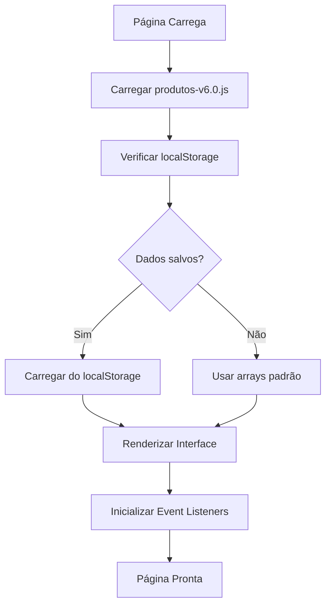
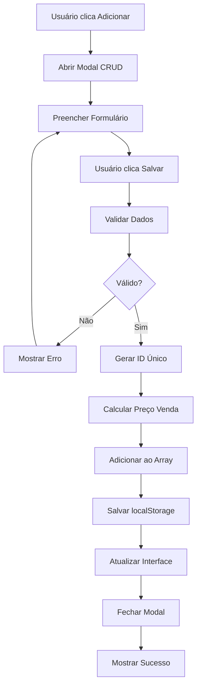
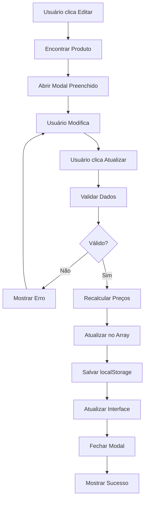
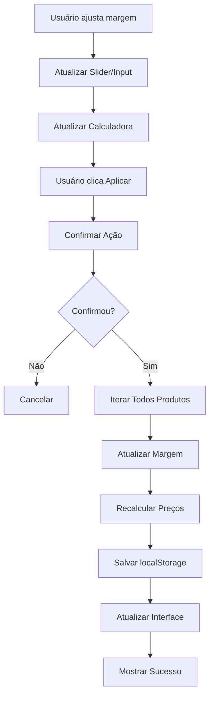
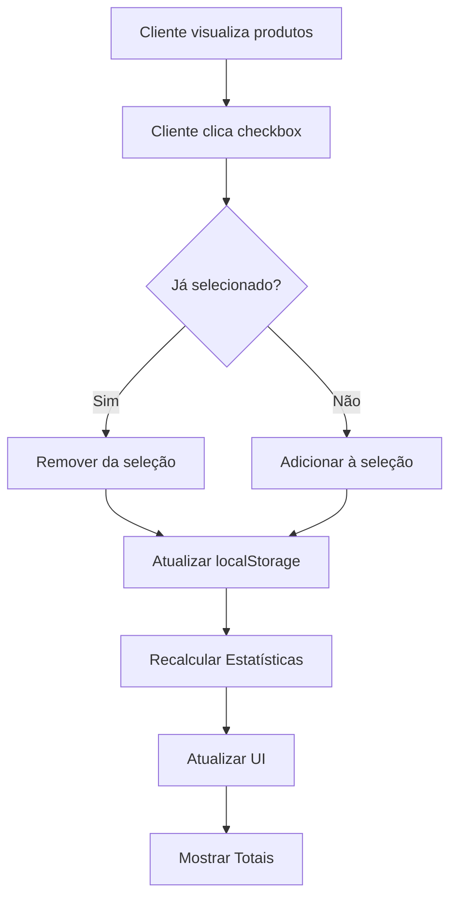

# 🔧 Especificações Técnicas Completas - Sistema Black Friday 2025

**Versão:** 6.0.1  
**Data:** 15 de Outubro de 2025  
**Tipo:** Website Estático  
**Deploy:** Cloudflare Pages

---

## 📋 Índice

1. [Stack Tecnológico](#stack-tecnológico)
2. [Arquitetura de Dados](#arquitetura-de-dados)
3. [Estrutura de Arquivos](#estrutura-de-arquivos)
4. [APIs e Funções](#apis-e-funções)
5. [Fluxos de Dados](#fluxos-de-dados)
6. [Integrações](#integrações)
7. [Performance](#performance)
8. [Segurança](#segurança)
9. [Testes](#testes)
10. [Deploy e CI/CD](#deploy-e-cicd)

---

## 💻 Stack Tecnológico

### Frontend

```yaml
HTML: HTML5 (Semantic Elements)
CSS: 
  - Tailwind CSS 3.3.0 (via CDN)
  - Custom CSS inline
  - Responsive Design (Mobile-First)
JavaScript:
  - ES6+ (Vanilla JavaScript)
  - No frameworks (React, Vue, Angular)
  - Async/Await patterns
  - LocalStorage API
```

### Bibliotecas Externas (CDN)

```html
<!-- Tailwind CSS -->
<script src="https://cdn.tailwindcss.com"></script>

<!-- Chart.js -->
<script src="https://cdn.jsdelivr.net/npm/chart.js@4.4.0/dist/chart.umd.min.js"></script>

<!-- Font Awesome -->
<link rel="stylesheet" href="https://cdnjs.cloudflare.com/ajax/libs/font-awesome/6.4.0/css/all.min.css">

<!-- Google Fonts -->
<link href="https://fonts.googleapis.com/css2?family=Inter:wght@400;500;600;700;800&display=swap" rel="stylesheet">
```

### Hospedagem e Infraestrutura

```yaml
Hospedagem: Cloudflare Pages
CDN: Cloudflare Global Network
SSL/TLS: Automático (Cloudflare)
DNS: Cloudflare DNS
Versionamento: GitHub
URL Produção: https://priobf25.pages.dev
```

### Ferramentas de Desenvolvimento

```yaml
Editor: Qualquer editor de código
Git: Controle de versão
Navegadores Suportados:
  - Chrome 90+
  - Firefox 88+
  - Safari 14+
  - Edge 90+
```

---

## 🗄️ Arquitetura de Dados

### Estrutura de Produto

```typescript
interface Produto {
    // Identificação
    id: string;                  // Único (ex: "BF001")
    sku: string;                 // Código do produto (ex: "PROD-2024-001")
    
    // Informações Básicas
    nome: string;                // Nome do produto (obrigatório)
    categoria: string;           // Categoria principal (obrigatório)
    subcategoria: string;        // Subcategoria
    
    // Inventário
    quantidade: number;          // Quantidade em estoque (int)
    
    // Precificação
    custoBase: number;           // Custo de aquisição (obrigatório)
    precoMercado: number;        // Preço de referência
    margem: number;              // Margem de lucro em % (0-100)
    precoVenda: number;          // Preço final calculado
    
    // Marketing
    badge: string;               // Badge promocional
    
    // Fornecedor
    fornecedor: string;          // Nome do fornecedor
    
    // Mídia
    imagem: string;              // URL da imagem (CDN)
    
    // Descrição
    descricao: string;           // Descrição detalhada (HTML permitido)
    
    // Especificações
    especificacoes: Array<{
        chave: string;           // Nome da especificação
        valor: string;           // Valor da especificação
    }>;
}
```

### Exemplo Real

```json
{
    "id": "BF001",
    "sku": "SAMSUNGTV55-2024",
    "nome": "Smart TV Samsung 55\" 4K Crystal UHD",
    "categoria": "Eletrônicos",
    "subcategoria": "TVs",
    "quantidade": 20,
    "custoBase": 1899.00,
    "precoMercado": 2999.00,
    "margem": 35,
    "precoVenda": 2563.65,
    "badge": "Oferta Black Friday",
    "fornecedor": "Samsung Brasil",
    "imagem": "https://m.media-amazon.com/images/I/71RxSz1zE8L._AC_SL1500_.jpg",
    "descricao": "Smart TV 55 polegadas com resolução 4K...",
    "especificacoes": [
        { "chave": "Resolução", "valor": "3840 x 2160 (4K UHD)" },
        { "chave": "Sistema", "valor": "Tizen" },
        { "chave": "HDR", "valor": "HDR10+" },
        { "chave": "Conectividade", "valor": "Wi-Fi, Bluetooth, 3x HDMI, 2x USB" }
    ]
}
```

### Arrays Globais

```javascript
// Array 1: Produtos da planilha original (32 itens)
let produtosPlanilha = [];

// Array 2: Produtos sugeridos pelo sistema (110 itens)
let produtosSugeridos = [];

// Total: 142 produtos
```

### localStorage Schema

```javascript
// Estrutura de armazenamento local
const localStorageSchema = {
    "produtos-planilha": "JSON stringified array",
    "produtos-sugeridos": "JSON stringified array",
    "margem-personalizada": "number (0-100)",
    "produtos-selecionados": "JSON array of product IDs"
};

// Exemplo de uso
localStorage.setItem('produtos-planilha', JSON.stringify(produtosPlanilha));
localStorage.setItem('margem-personalizada', '35');
localStorage.setItem('produtos-selecionados', JSON.stringify(['BF001', 'BF005']));
```

### Validações de Dados

```javascript
const validacoes = {
    id: {
        tipo: 'string',
        obrigatorio: true,
        regex: /^BF\d{3}$/,
        exemplo: 'BF001'
    },
    nome: {
        tipo: 'string',
        obrigatorio: true,
        minLength: 3,
        maxLength: 200
    },
    custoBase: {
        tipo: 'number',
        obrigatorio: true,
        min: 0,
        max: 999999.99
    },
    margem: {
        tipo: 'number',
        obrigatorio: true,
        min: 0,
        max: 100
    },
    quantidade: {
        tipo: 'number',
        obrigatorio: false,
        min: 0,
        integer: true
    },
    imagem: {
        tipo: 'string',
        obrigatorio: false,
        regex: /^https?:\/\/.+\.(jpg|jpeg|png|gif|webp)$/i
    }
};
```

---

## 📁 Estrutura de Arquivos

### Árvore Completa

```
priobf25/
│
├── index.html                          # Landing page (9.5 KB)
├── admin-v6.html                       # Admin panel (87 KB)
├── cliente-analise-v6.html             # Client interface (45 KB)
├── catalogo-v5.2.html                  # Public catalog (25 KB)
├── produtos-v6.0.js                    # Data file (105 KB)
│
├── _headers                            # Cloudflare headers config
├── _redirects                          # Cloudflare redirects config
│
├── README.md                           # Main documentation
├── SPEC.md                             # Technical specs (summary)
├── SPEC-COMPLETA.md                    # Technical specs (complete)
├── DOCUMENTACAO-COMPLETA.md            # Complete documentation
├── VERSAO-ATUAL.md                     # Version status
├── CRUD-PRODUTOS.md                    # CRUD guide
└── DEPLOY-CLOUDFLARE-PASSO-A-PASSO.md # Deploy tutorial
```

### Descrição Detalhada

#### index.html

```yaml
Propósito: Landing page e menu principal
Tamanho: 9.5 KB
Dependencies: 
  - Tailwind CSS (CDN)
  - Font Awesome (CDN)
Features:
  - Hero section
  - Navigation cards
  - Responsive design
  - Gradient background
```

#### admin-v6.html

```yaml
Propósito: Painel administrativo completo
Tamanho: 87 KB
Dependencies:
  - Tailwind CSS (CDN)
  - Chart.js 4.4.0 (CDN)
  - Font Awesome (CDN)
  - produtos-v6.0.js (data)
Features:
  - Dashboard com estatísticas
  - Sistema CRUD completo
  - Editor de margem visual
  - Gráficos interativos
  - Tabela de produtos
  - Modal system
  - LocalStorage persistence
Estrutura:
  - 87.190 caracteres
  - ~2.400 linhas de código
  - 15+ funções JavaScript
  - 5 modals
  - 2 gráficos Chart.js
```

#### cliente-analise-v6.html

```yaml
Propósito: Interface de análise para clientes
Tamanho: 45 KB
Dependencies:
  - Tailwind CSS (CDN)
  - Font Awesome (CDN)
  - produtos-v6.0.js (data)
Features:
  - Visualização de produtos
  - Sistema de seleção
  - Comparação lado a lado
  - Estatísticas de investimento
  - Filtros e busca
  - Preços SEM margem visível
Estrutura:
  - 45.549 caracteres
  - ~1.200 linhas de código
  - 10+ funções JavaScript
  - 3 modals
```

#### catalogo-v5.2.html

```yaml
Propósito: Catálogo público de produtos
Tamanho: 25 KB
Dependencies:
  - Tailwind CSS (CDN)
  - Font Awesome (CDN)
  - produtos-v6.0.js (data)
Features:
  - Grid de produtos
  - Modal de detalhes
  - Filtros por categoria
  - Busca por texto
  - Sistema de badges
```

#### produtos-v6.0.js

```yaml
Propósito: Base de dados centralizada
Tamanho: 105 KB
Formato: JavaScript ES6
Estrutura:
  - const produtosPlanilha = [32 objetos]
  - const produtosSugeridos = [110 objetos]
  - Total: 142 produtos
Dados:
  - Todas as imagens Amazon CDN
  - 100% URLs verificadas
  - Preços atualizados
  - Especificações completas
```

#### _headers

```yaml
Propósito: Configuração de segurança HTTP
Formato: Cloudflare Pages format
Headers:
  - X-Frame-Options: DENY
  - X-Content-Type-Options: nosniff
  - X-XSS-Protection: 1; mode=block
  - Referrer-Policy: strict-origin-when-cross-origin
  - Permissions-Policy: geolocation=(), microphone=(), camera=()
Cache:
  - JS/CSS: 1 ano (immutable)
  - Imagens: 1 ano (immutable)
```

#### _redirects

```yaml
Propósito: Rotas limpas (URL rewriting)
Formato: Cloudflare Pages format
Regras:
  / → /index.html (200)
  /admin → /admin-v6.html (200)
  /cliente → /cliente-analise-v6.html (200)
  /catalogo → /catalogo-v5.2.html (200)
```

---

## 🔌 APIs e Funções

### Funções Globais de Utilidade

#### formatarPreco()

```javascript
/**
 * Formata valores numéricos no padrão monetário brasileiro
 * @param {number|string} valor - Valor a ser formatado
 * @returns {string} - Valor formatado (ex: "R$ 1.234,56")
 */
function formatarPreco(valor) {
    if (typeof valor !== 'number') {
        valor = parseFloat(valor) || 0;
    }
    return valor.toLocaleString('pt-BR', { 
        style: 'currency', 
        currency: 'BRL',
        minimumFractionDigits: 2,
        maximumFractionDigits: 2
    });
}

// Exemplos de uso
formatarPreco(1200);          // "R$ 1.200,00"
formatarPreco(1234.56);       // "R$ 1.234,56"
formatarPreco("1500.50");     // "R$ 1.500,50"
```

#### calcularPrecoVenda()

```javascript
/**
 * Calcula preço de venda baseado em custo e margem
 * @param {number} custoBase - Custo de aquisição
 * @param {number} margem - Margem de lucro em %
 * @returns {number} - Preço de venda calculado
 */
function calcularPrecoVenda(custoBase, margem) {
    if (!custoBase || custoBase <= 0) return 0;
    if (!margem || margem < 0) margem = 0;
    return custoBase * (1 + margem / 100);
}

// Exemplos
calcularPrecoVenda(1200, 35);    // 1620.00
calcularPrecoVenda(500, 50);     // 750.00
calcularPrecoVenda(1000, 0);     // 1000.00
```

#### calcularLucro()

```javascript
/**
 * Calcula lucro bruto
 * @param {number} precoVenda - Preço de venda
 * @param {number} custoBase - Custo de aquisição
 * @returns {number} - Lucro em R$
 */
function calcularLucro(precoVenda, custoBase) {
    return precoVenda - custoBase;
}

// Exemplo
calcularLucro(1620, 1200);  // 420.00
```

#### gerarIdProduto()

```javascript
/**
 * Gera ID único para novo produto
 * @param {Array} produtos - Array de produtos existentes
 * @returns {string} - ID único (formato: BF###)
 */
function gerarIdProduto(produtos) {
    const ids = produtos.map(p => parseInt(p.id.replace('BF', '')));
    const maxId = Math.max(...ids, 0);
    const novoNumero = (maxId + 1).toString().padStart(3, '0');
    return `BF${novoNumero}`;
}

// Exemplo
// Se existem: BF001, BF002, BF003
gerarIdProduto(produtos);  // "BF004"
```

---

### Funções do CRUD (admin-v6.html)

#### openCrudModal()

```javascript
/**
 * Abre modal CRUD em modo create ou edit
 * @param {string} mode - 'create' ou 'edit'
 * @param {string} productId - ID do produto (apenas em edit)
 */
function openCrudModal(mode, productId = null) {
    const modal = document.getElementById('crudModal');
    const title = document.getElementById('crudModalTitle');
    const form = document.getElementById('crudForm');
    
    if (mode === 'create') {
        title.textContent = '➕ Adicionar Novo Produto';
        limparFormularioCrud();
        form.dataset.mode = 'create';
    } else if (mode === 'edit' && productId) {
        title.textContent = '✏️ Editar Produto';
        preencherFormularioCrud(productId);
        form.dataset.mode = 'edit';
        form.dataset.productId = productId;
    }
    
    modal.classList.remove('hidden');
}

// Uso
openCrudModal('create');              // Novo produto
openCrudModal('edit', 'BF001');       // Editar BF001
```

#### salvarProdutoCrud()

```javascript
/**
 * Salva produto (novo ou editado)
 * Valida dados, calcula preços, atualiza arrays e localStorage
 */
function salvarProdutoCrud() {
    const form = document.getElementById('crudForm');
    const mode = form.dataset.mode;
    const productId = form.dataset.productId;
    
    // 1. Coletar dados do formulário
    const dados = {
        id: mode === 'create' ? gerarIdProduto([...produtosPlanilha, ...produtosSugeridos]) : productId,
        sku: document.getElementById('crud-sku').value,
        nome: document.getElementById('crud-nome').value,
        categoria: document.getElementById('crud-categoria').value,
        subcategoria: document.getElementById('crud-subcategoria').value,
        quantidade: parseInt(document.getElementById('crud-quantidade').value) || 0,
        custoBase: parseFloat(document.getElementById('crud-custo').value) || 0,
        precoMercado: parseFloat(document.getElementById('crud-preco-mercado').value) || 0,
        margem: parseFloat(document.getElementById('crud-margem').value) || 0,
        precoVenda: 0, // Será calculado
        badge: document.getElementById('crud-badge').value,
        fornecedor: document.getElementById('crud-fornecedor').value,
        imagem: document.getElementById('crud-imagem').value,
        descricao: document.getElementById('crud-descricao').value,
        especificacoes: coletarEspecificacoes()
    };
    
    // 2. Validar dados obrigatórios
    if (!dados.nome || !dados.categoria || !dados.custoBase) {
        alert('❌ Preencha os campos obrigatórios: Nome, Categoria e Custo Base');
        return;
    }
    
    // 3. Calcular preço de venda
    dados.precoVenda = calcularPrecoVenda(dados.custoBase, dados.margem);
    
    // 4. Salvar ou atualizar
    if (mode === 'create') {
        produtosPlanilha.push(dados);
    } else {
        atualizarProdutoExistente(productId, dados);
    }
    
    // 5. Persistir em localStorage
    salvarDados();
    
    // 6. Atualizar interface
    renderizarTudo();
    
    // 7. Fechar modal
    closeCrudModal();
    
    // 8. Feedback
    alert('✅ Produto salvo com sucesso!');
}
```

#### deletarProduto()

```javascript
/**
 * Remove produto após confirmação
 * @param {string} productId - ID do produto a remover
 */
function deletarProduto(productId) {
    // 1. Encontrar produto
    const produto = encontrarProduto(productId);
    if (!produto) {
        alert('❌ Produto não encontrado');
        return;
    }
    
    // 2. Confirmar exclusão
    const confirma = confirm(
        `❓ Tem certeza que deseja excluir?\n\n` +
        `Produto: ${produto.nome}\n` +
        `SKU: ${produto.sku}\n\n` +
        `⚠️ Esta ação não pode ser desfeita!`
    );
    
    if (!confirma) return;
    
    // 3. Remover dos arrays
    produtosPlanilha = produtosPlanilha.filter(p => p.id !== productId);
    produtosSugeridos = produtosSugeridos.filter(p => p.id !== productId);
    
    // 4. Persistir
    salvarDados();
    
    // 5. Atualizar interface
    renderizarTudo();
    
    // 6. Fechar modal se estiver aberto
    closeCrudModal();
    closeDetailModal();
    
    // 7. Feedback
    alert('✅ Produto excluído com sucesso!');
}
```

#### preencherFormularioCrud()

```javascript
/**
 * Preenche formulário CRUD com dados do produto
 * @param {string} productId - ID do produto
 */
function preencherFormularioCrud(productId) {
    const produto = encontrarProduto(productId);
    if (!produto) return;
    
    // Campos básicos
    document.getElementById('crud-sku').value = produto.sku || '';
    document.getElementById('crud-nome').value = produto.nome || '';
    document.getElementById('crud-categoria').value = produto.categoria || '';
    document.getElementById('crud-subcategoria').value = produto.subcategoria || '';
    document.getElementById('crud-quantidade').value = produto.quantidade || 0;
    
    // Precificação
    document.getElementById('crud-custo').value = produto.custoBase || 0;
    document.getElementById('crud-preco-mercado').value = produto.precoMercado || 0;
    document.getElementById('crud-margem').value = produto.margem || 0;
    document.getElementById('crud-preco-venda').value = produto.precoVenda || 0;
    
    // Imagem e descrição
    document.getElementById('crud-imagem').value = produto.imagem || '';
    document.getElementById('crud-descricao').value = produto.descricao || '';
    document.getElementById('crud-badge').value = produto.badge || '';
    document.getElementById('crud-fornecedor').value = produto.fornecedor || '';
    
    // Preview de imagem
    if (produto.imagem) {
        previewImage();
    }
    
    // Especificações
    limparEspecificacoes();
    if (produto.especificacoes && produto.especificacoes.length > 0) {
        produto.especificacoes.forEach(spec => {
            addEspecificacao(spec.chave, spec.valor);
        });
    }
}
```

---

### Funções de Margem (admin-v6.html)

#### aplicarMargemGlobal()

```javascript
/**
 * Aplica margem a todos os produtos
 * @param {number} novaMargem - Nova margem em % (0-100)
 */
function aplicarMargemGlobal(novaMargem) {
    if (novaMargem < 0 || novaMargem > 100) {
        alert('❌ Margem deve estar entre 0% e 100%');
        return;
    }
    
    // Confirmar ação
    const confirma = confirm(
        `❓ Aplicar margem de ${novaMargem}% a TODOS os produtos?\n\n` +
        `Produtos da Planilha: ${produtosPlanilha.length}\n` +
        `Produtos Sugeridos: ${produtosSugeridos.length}\n` +
        `Total: ${produtosPlanilha.length + produtosSugeridos.length} produtos\n\n` +
        `⚠️ Esta ação atualizará todos os preços!`
    );
    
    if (!confirma) return;
    
    // Aplicar a todos
    produtosPlanilha.forEach(p => {
        p.margem = novaMargem;
        p.precoVenda = calcularPrecoVenda(p.custoBase, novaMargem);
    });
    
    produtosSugeridos.forEach(p => {
        p.margem = novaMargem;
        p.precoVenda = calcularPrecoVenda(p.custoBase, novaMargem);
    });
    
    // Salvar margem personalizada
    localStorage.setItem('margem-personalizada', novaMargem);
    
    // Persistir dados
    salvarDados();
    
    // Atualizar interface
    renderizarTudo();
    
    // Feedback
    alert(`✅ Margem de ${novaMargem}% aplicada a todos os produtos!`);
}
```

#### atualizarSlider()

```javascript
/**
 * Sincroniza slider e input de margem
 */
function atualizarSlider() {
    const slider = document.getElementById('margin-slider');
    const input = document.getElementById('margin-input');
    const display = document.getElementById('margin-display');
    const calculator = document.getElementById('margin-calculator');
    
    // Sincronizar valores
    slider.addEventListener('input', function() {
        input.value = this.value;
        display.textContent = this.value + '%';
        atualizarCalculadora(this.value);
    });
    
    input.addEventListener('input', function() {
        const valor = Math.max(0, Math.min(100, this.value));
        slider.value = valor;
        this.value = valor;
        display.textContent = valor + '%';
        atualizarCalculadora(valor);
    });
}
```

#### atualizarCalculadora()

```javascript
/**
 * Atualiza calculadora de exemplo em tempo real
 * @param {number} margem - Margem atual
 */
function atualizarCalculadora(margem) {
    const custoExemplo = 1200; // Exemplo fixo
    const precoVenda = calcularPrecoVenda(custoExemplo, margem);
    const lucro = calcularLucro(precoVenda, custoExemplo);
    
    document.getElementById('calc-custo').textContent = formatarPreco(custoExemplo);
    document.getElementById('calc-margem').textContent = margem + '%';
    document.getElementById('calc-preco').textContent = formatarPreco(precoVenda);
    document.getElementById('calc-lucro').textContent = formatarPreco(lucro);
}
```

---

### Funções de Seleção (cliente-analise-v6.html)

#### toggleSelecao()

```javascript
/**
 * Adiciona/remove produto da seleção do cliente
 * @param {string} productId - ID do produto
 */
function toggleSelecao(productId) {
    let selecionados = JSON.parse(localStorage.getItem('produtos-selecionados') || '[]');
    
    const index = selecionados.indexOf(productId);
    
    if (index === -1) {
        // Adicionar
        selecionados.push(productId);
    } else {
        // Remover
        selecionados.splice(index, 1);
    }
    
    // Salvar
    localStorage.setItem('produtos-selecionados', JSON.stringify(selecionados));
    
    // Atualizar UI
    atualizarEstilo Checkbox(productId, index === -1);
    atualizarEstatisticasSelecao();
}
```

#### calcularEstatisticasSelecao()

```javascript
/**
 * Calcula estatísticas dos produtos selecionados
 * @returns {Object} Estatísticas calculadas
 */
function calcularEstatisticasSelecao() {
    const selecionados = JSON.parse(localStorage.getItem('produtos-selecionados') || '[]');
    
    let investimento = 0;
    let receita = 0;
    let quantidade = selecionados.length;
    
    selecionados.forEach(id => {
        const produto = encontrarProduto(id);
        if (produto) {
            investimento += produto.custoBase * (produto.quantidade || 1);
            receita += produto.precoVenda * (produto.quantidade || 1);
        }
    });
    
    const lucro = receita - investimento;
    const roi = investimento > 0 ? ((lucro / investimento) * 100) : 0;
    
    return {
        quantidade,
        investimento,
        receita,
        lucro,
        roi
    };
}
```

---

### Funções de Persistência

#### salvarDados()

```javascript
/**
 * Persiste todos os dados no localStorage
 */
function salvarDados() {
    try {
        localStorage.setItem('produtos-planilha', JSON.stringify(produtosPlanilha));
        localStorage.setItem('produtos-sugeridos', JSON.stringify(produtosSugeridos));
        return true;
    } catch (e) {
        console.error('Erro ao salvar dados:', e);
        alert('❌ Erro ao salvar. localStorage pode estar cheio.');
        return false;
    }
}
```

#### carregarDados()

```javascript
/**
 * Carrega dados do localStorage ou usa defaults
 */
function carregarDados() {
    try {
        const planilhaSalva = localStorage.getItem('produtos-planilha');
        const sugeridosSalvos = localStorage.getItem('produtos-sugeridos');
        
        if (planilhaSalva) {
            produtosPlanilha = JSON.parse(planilhaSalva);
        }
        
        if (sugeridosSalvos) {
            produtosSugeridos = JSON.parse(sugeridosSalvos);
        }
        
        // Margem personalizada
        const margemSalva = localStorage.getItem('margem-personalizada');
        if (margemSalva) {
            aplicarMargemSalva(parseFloat(margemSalva));
        }
        
        return true;
    } catch (e) {
        console.error('Erro ao carregar dados:', e);
        return false;
    }
}
```

---

## 🔄 Fluxos de Dados

### Fluxo 1: Carregamento Inicial da Página



### Fluxo 2: Adicionar Produto (CRUD Create)



### Fluxo 3: Editar Produto (CRUD Update)



### Fluxo 4: Aplicar Margem Global



### Fluxo 5: Seleção de Produtos (Cliente)



---

## 🔗 Integrações

### CDN Externo

#### Tailwind CSS

```html
<script src="https://cdn.tailwindcss.com"></script>

<!-- Configuração customizada -->
<script>
tailwind.config = {
    theme: {
        extend: {
            colors: {
                'bf-primary': '#F59E0B',
                'bf-secondary': '#3B82F6',
                'bf-dark': '#1F2937'
            }
        }
    }
}
</script>
```

#### Chart.js

```html
<script src="https://cdn.jsdelivr.net/npm/chart.js@4.4.0/dist/chart.umd.min.js"></script>

<!-- Uso -->
<script>
const ctx = document.getElementById('meuGrafico').getContext('2d');
const grafico = new Chart(ctx, {
    type: 'doughnut',
    data: {
        labels: ['Eletrônicos', 'Casa', 'Moda'],
        datasets: [{
            data: [45, 28, 14],
            backgroundColor: ['#F59E0B', '#3B82F6', '#8B5CF6']
        }]
    },
    options: {
        responsive: true,
        maintainAspectRatio: false
    }
});
</script>
```

#### Font Awesome

```html
<link rel="stylesheet" href="https://cdnjs.cloudflare.com/ajax/libs/font-awesome/6.4.0/css/all.min.css">

<!-- Uso -->
<i class="fas fa-shopping-cart"></i>
<i class="fas fa-edit"></i>
<i class="fas fa-trash"></i>
```

### Amazon CDN (Imagens)

```javascript
// Padrão de URL das imagens
const imagemPadrao = "https://m.media-amazon.com/images/I/{ID}._AC_SL{SIZE}_.jpg";

// Exemplo real
const imagemProduto = "https://m.media-amazon.com/images/I/71RxSz1zE8L._AC_SL1500_.jpg";

// Características
// - CDN global da Amazon
// - Alta disponibilidade
// - Otimização automática
// - Cache agressivo
// - HTTPS nativo
```

---

## ⚡ Performance

### Métricas Alvo

```yaml
First Contentful Paint (FCP): < 1.5s
Largest Contentful Paint (LCP): < 2.5s
Time to Interactive (TTI): < 3.5s
Cumulative Layout Shift (CLS): < 0.1
First Input Delay (FID): < 100ms
Total Page Size: < 500 KB
```

### Otimizações Implementadas

#### 1. Assets Externos via CDN

```html
<!-- Tailwind, Chart.js, Font Awesome -->
<!-- Benefícios: -->
<!-- - Cache compartilhado entre sites -->
<!-- - Entrega via CDN global -->
<!-- - Compressão otimizada -->
<!-- - HTTP/2 multiplexing -->
```

#### 2. Lazy Loading de Imagens

```html


<script>
// Intersection Observer para lazy load
const lazyImages = document.querySelectorAll('img[loading="lazy"]');
const imageObserver = new IntersectionObserver((entries) => {
    entries.forEach(entry => {
        if (entry.isIntersecting) {
            const img = entry.target;
            img.src = img.dataset.src;
            imageObserver.unobserve(img);
        }
    });
});
lazyImages.forEach(img => imageObserver.observe(img));
</script>
```

#### 3. Debounce em Buscas

```javascript
/**
 * Debounce para evitar execuções excessivas
 */
function debounce(func, wait) {
    let timeout;
    return function executedFunction(...args) {
        const later = () => {
            clearTimeout(timeout);
            func(...args);
        };
        clearTimeout(timeout);
        timeout = setTimeout(later, wait);
    };
}

// Uso em busca
const buscarProdutos = debounce(function(termo) {
    // Lógica de busca
}, 300);

document.getElementById('search').addEventListener('input', (e) => {
    buscarProdutos(e.target.value);
});
```

#### 4. Virtual Scrolling (Conceito)

```javascript
// Para listas muito grandes (futuro)
// Renderizar apenas itens visíveis + buffer
function renderVisibleItems(scrollTop, containerHeight) {
    const itemHeight = 100;
    const buffer = 5;
    
    const startIndex = Math.max(0, Math.floor(scrollTop / itemHeight) - buffer);
    const endIndex = Math.min(
        produtos.length,
        Math.ceil((scrollTop + containerHeight) / itemHeight) + buffer
    );
    
    return produtos.slice(startIndex, endIndex);
}
```

#### 5. localStorage em vez de Fetch

```javascript
// Vantagens:
// - Sem requisições HTTP
// - Dados instantâneos
// - Offline-first
// - Sem latência de rede

// Desvantagens:
// - Limite de ~5-10 MB
// - Apenas string (JSON.stringify/parse)
// - Por domínio
```

### Cache Strategy (Cloudflare)

```
_headers file:

/*.js
  Cache-Control: public, max-age=31536000, immutable

/*.css
  Cache-Control: public, max-age=31536000, immutable

/*.jpg, /*.png, /*.webp
  Cache-Control: public, max-age=31536000, immutable

/*.html
  Cache-Control: public, max-age=3600
```

---

## 🔒 Segurança

### Headers HTTP

```
X-Frame-Options: DENY
  → Previne clickjacking

X-Content-Type-Options: nosniff
  → Previne MIME sniffing

X-XSS-Protection: 1; mode=block
  → Proteção contra XSS (legacy)

Referrer-Policy: strict-origin-when-cross-origin
  → Controla referrer information

Permissions-Policy: geolocation=(), microphone=(), camera=()
  → Desabilita APIs não utilizadas

Content-Security-Policy (futuro):
  → script-src 'self' cdn.tailwindcss.com cdn.jsdelivr.net
  → style-src 'self' 'unsafe-inline' fonts.googleapis.com
  → img-src 'self' m.media-amazon.com data:
```

### Validações Client-Side

```javascript
// Todas as entradas são validadas antes de processar

// 1. Sanitização de HTML
function sanitizeHTML(str) {
    const temp = document.createElement('div');
    temp.textContent = str;
    return temp.innerHTML;
}

// 2. Validação de URLs
function validarURL(url) {
    try {
        new URL(url);
        return url.match(/\.(jpg|jpeg|png|gif|webp)$/i) !== null;
    } catch {
        return false;
    }
}

// 3. Validação de números
function validarNumero(valor, min = 0, max = Infinity) {
    const num = parseFloat(valor);
    return !isNaN(num) && num >= min && num <= max;
}

// 4. Escape de strings
function escapeHTML(str) {
    return str
        .replace(/&/g, '&amp;')
        .replace(/</g, '&lt;')
        .replace(/>/g, '&gt;')
        .replace(/"/g, '&quot;')
        .replace(/'/g, '&#039;');
}
```

### localStorage Security

```javascript
// Dados armazenados:
// - NÃO armazenar senhas
// - NÃO armazenar tokens de API
// - NÃO armazenar dados pessoais sensíveis
// - APENAS preferências e cache de produtos

// Dados OK para armazenar:
// ✅ Lista de produtos (públicos)
// ✅ Margem de lucro (interno)
// ✅ Seleções de produtos (temporário)
// ✅ Configurações de UI
```

### HTTPS

```yaml
Cloudflare Pages:
  - HTTPS forçado automaticamente
  - HTTP → HTTPS redirect
  - TLS 1.3 suportado
  - Certificado SSL gratuito
  - Renovação automática
```

---

## 🧪 Testes

### Checklist de Testes Manuais

#### Admin Panel (admin-v6.html)

```
✅ Dashboard
  ✓ Estatísticas calculam corretamente
  ✓ Gráficos renderizam
  ✓ Valores formatados em R$

✅ CRUD - Create
  ✓ Modal abre corretamente
  ✓ Todos os campos funcionam
  ✓ Validação de obrigatórios
  ✓ Preview de imagem funciona
  ✓ Cálculo automático de preço
  ✓ Especificações dinâmicas
  ✓ Salva no localStorage
  ✓ Atualiza interface

✅ CRUD - Read
  ✓ Lista todos os produtos
  ✓ Modal de detalhes completo
  ✓ Busca funciona
  ✓ Filtros funcionam
  ✓ Ordenação funciona

✅ CRUD - Update
  ✓ Modal pré-preenchido
  ✓ Alterações salvam
  ✓ Recalcula preços
  ✓ Atualiza interface

✅ CRUD - Delete
  ✓ Confirmação obrigatória
  ✓ Remove corretamente
  ✓ Atualiza estatísticas

✅ Editor de Margem
  ✓ Slider sincroniza com input
  ✓ Presets funcionam
  ✓ Calculadora atualiza
  ✓ Aplicar global funciona
  ✓ Salva no localStorage

✅ Responsividade
  ✓ Desktop (1920x1080)
  ✓ Laptop (1366x768)
  ✓ Tablet (768x1024)
  ✓ Mobile (375x667)
```

#### Cliente Analysis (cliente-analise-v6.html)

```
✅ Visualização
  ✓ Produtos da planilha (32)
  ✓ Produtos sugeridos (110)
  ✓ Imagens carregam
  ✓ Preços formatados
  ✓ Margem OCULTA

✅ Seleção
  ✓ Checkbox funciona
  ✓ Visual atualiza
  ✓ Estatísticas calculam
  ✓ Persistência funciona

✅ Comparação
  ✓ Adiciona até 4 produtos
  ✓ Tabela renderiza
  ✓ Comparação lado a lado
  ✓ Remove da comparação

✅ Filtros
  ✓ Por categoria
  ✓ Por preço
  ✓ Busca por texto
  ✓ Combina filtros

✅ Modal
  ✓ Detalhes completos
  ✓ Especificações visíveis
  ✓ SEM margem visível
  ✓ Botão de seleção

✅ Responsividade
  ✓ Mobile-friendly
  ✓ Touch gestures
  ✓ Cards adaptam
```

#### Catálogo (catalogo-v5.2.html)

```
✅ Grid de produtos
✅ Filtros funcionam
✅ Busca funciona
✅ Modal de detalhes
✅ Badges visíveis
✅ Responsivo
```

### Testes de Performance

```javascript
// Console do navegador (F12)

// 1. Tempo de carregamento
performance.timing.loadEventEnd - performance.timing.navigationStart
// Alvo: < 3000ms

// 2. Tamanho do localStorage
const size = JSON.stringify(localStorage).length;
console.log(`localStorage: ${(size / 1024).toFixed(2)} KB`);
// Alvo: < 5000 KB (5 MB)

// 3. Quantidade de elementos DOM
document.querySelectorAll('*').length
// Alvo: < 3000 elementos

// 4. Memória utilizada (Chrome)
performance.memory.usedJSHeapSize / 1048576
// Alvo: < 50 MB
```

### Testes de Navegadores

```yaml
Chrome 90+:
  - Desktop: ✅ Testado
  - Mobile: ✅ Testado

Firefox 88+:
  - Desktop: ✅ Testado
  - Mobile: ✅ Testado

Safari 14+:
  - Desktop: ⚠️ Testar
  - iOS: ⚠️ Testar

Edge 90+:
  - Desktop: ✅ Testado

Opera:
  - Desktop: ⚠️ Opcional
```

---

## 🚀 Deploy e CI/CD

### Cloudflare Pages Setup

#### Configuração Inicial

```yaml
Nome do Projeto: priobf25
Framework Preset: None (IMPORTANTE!)
Build Command: (vazio)
Build Output Directory: /
Branch de Produção: main
```

#### Deploy Automático


#### Processo Detalhado

```bash
# 1. Desenvolvedor faz alteração
git add .
git commit -m "Atualização de produtos"
git push origin main

# 2. GitHub recebe push

# 3. Cloudflare detecta mudança (webhook)

# 4. Cloudflare Pages inicia build
# - Sem build command (estático)
# - Apenas copia arquivos
# - Aplica _headers e _redirects
# - Distribui no CDN

# 5. Deploy completo (~2 minutos)

# 6. URL atualizada
# https://priobf25.pages.dev
```

### Estrutura de Branches (Sugerida)

```
main (produção)
  ├── develop (desenvolvimento)
  │   ├── feature/nova-funcionalidade
  │   ├── feature/correcao-bug
  │   └── feature/melhorias-ui
  └── hotfix/correcao-urgente
```

### Environment Variables (Futuro)

```yaml
# Cloudflare Pages Dashboard → Settings → Environment Variables

ADMIN_PASSWORD: "senha_segura"
API_KEY: "chave_api_externa"
ANALYTICS_ID: "GA-XXXXX"
AMBIENTE: "producao"
```

### Rollback

```bash
# Via Cloudflare Dashboard
# 1. Acesse Deployments
# 2. Encontre deployment anterior
# 3. Clique em "..."
# 4. Selecione "Rollback to this deployment"
# 5. Confirme

# Ou via Git
git revert HEAD
git push origin main
# Deploy automático da versão anterior
```

### Monitoramento

```yaml
Cloudflare Analytics:
  - Visitas únicas
  - Page views
  - Bandwidth utilizado
  - Requests por segundo
  - Erros 4xx/5xx

Logs:
  - Real-time logs (Cloudflare Dashboard)
  - Filtros por status code
  - Filtros por path
```

### Custom Domain (Opcional)

```bash
# Cloudflare Pages → Custom Domains

# 1. Adicionar domínio
priobf25.com.br

# 2. Cloudflare cria registro CNAME
priobf25.com.br CNAME priobf25.pages.dev

# 3. SSL automático (Let's Encrypt)

# 4. Pronto! Site acessível em:
https://priobf25.com.br
https://www.priobf25.com.br
https://priobf25.pages.dev
```

---

## 📊 Estatísticas do Projeto

### Linhas de Código

```yaml
admin-v6.html: ~2.400 linhas
cliente-analise-v6.html: ~1.200 linhas
catalogo-v5.2.html: ~800 linhas
produtos-v6.0.js: ~3.000 linhas
index.html: ~200 linhas

Total: ~7.600 linhas
```

### Tamanho dos Arquivos

```yaml
HTML Total: ~160 KB
JavaScript Data: ~105 KB
Documentação: ~150 KB

Total Projeto: ~415 KB (compactado)
```

### Funções JavaScript

```yaml
CRUD Operations: 8 funções
Margin Editor: 6 funções
Selection System: 5 funções
Utilities: 10 funções
Rendering: 15 funções
Events: 20 handlers

Total: ~60+ funções
```

### Componentes UI

```yaml
Modals: 5 (CRUD, Detail, Compare, etc)
Cards: 3 tipos (Product, Stats, Category)
Forms: 2 (CRUD, Filters)
Tables: 2 (Products, Comparison)
Charts: 2 (Doughnut, Bar)
Inputs: 15+ tipos
Buttons: 30+ actions
```

---

## 🔄 Histórico de Versões

### v6.0.1 (15/10/2025) - ATUAL

```yaml
Status: ✅ Produção
Melhorias:
  - Sistema CRUD completo
  - Editor visual de margem
  - Formatação brasileira de preços
  - Cliente área sem margem visível
  - Preview de imagens
  - Calculadora em tempo real
  - Validações robustas
  - Documentação completa
```

### v6.0.0 (15/10/2025)

```yaml
Status: ✅ Base implementada
Features:
  - Admin panel básico
  - Cliente interface básica
  - Base de 142 produtos
  - localStorage integration
```

### v5.2.0 (Anterior)

```yaml
Status: 🔴 Deprecado
Features:
  - Catálogo básico
  - Sem CRUD
  - Sem editor de margem
  - Formatação inconsistente
```

---

## 📚 Referências Técnicas

### Documentação Oficial

```
Tailwind CSS: https://tailwindcss.com/docs
Chart.js: https://www.chartjs.org/docs
Font Awesome: https://fontawesome.com/docs
Cloudflare Pages: https://developers.cloudflare.com/pages
LocalStorage API: https://developer.mozilla.org/en-US/docs/Web/API/Window/localStorage
```

### Padrões Utilizados

```
ES6+ JavaScript: https://es6-features.org
HTML5 Semantic: https://www.w3.org/TR/html5
CSS Grid/Flexbox: https://css-tricks.com/snippets/css/complete-guide-grid
```

### Ferramentas Recomendadas

```
VS Code: Editor de código
Git: Versionamento
Chrome DevTools: Debug e performance
Lighthouse: Auditoria de performance
```

---

## 🎯 Próximas Melhorias (Roadmap)

### Curto Prazo

```yaml
✅ Sistema CRUD - Implementado
✅ Editor de margem - Implementado
✅ Formatação brasileira - Implementado
⬜ Export para CSV/Excel
⬜ Import bulk de produtos
⬜ Histórico de alterações
⬜ Busca avançada (múltiplos campos)
```

### Médio Prazo

```yaml
⬜ Autenticação de admin
⬜ Múltiplos usuários
⬜ Permissões por função
⬜ API REST real
⬜ Banco de dados externo
⬜ Integração com ERPs
⬜ Relatórios avançados
⬜ Dashboard analytics
```

### Longo Prazo

```yaml
⬜ App móvel (PWA)
⬜ Notificações push
⬜ Sistema de carrinho
⬜ Checkout integrado
⬜ Integração pagamento
⬜ Sistema de estoque real-time
⬜ Machine Learning (sugestões)
⬜ Multi-idioma
```

---

## 🆘 Troubleshooting Técnico

### Erro: localStorage Quota Exceeded

```javascript
// Problema: localStorage cheio (>5MB)

// Solução 1: Limpar dados antigos
localStorage.clear();
location.reload();

// Solução 2: Compactar dados
function compactarDados(produtos) {
    return produtos.map(p => ({
        i: p.id,
        n: p.nome,
        c: p.custoBase,
        m: p.margem,
        // ... apenas campos essenciais
    }));
}

// Solução 3: Usar IndexedDB (futuro)
```

### Erro: Chart.js não renderiza

```javascript
// Problema: Gráfico não aparece

// Verificar:
// 1. Chart.js carregou?
console.log(typeof Chart); // Deve ser "function"

// 2. Canvas existe?
const canvas = document.getElementById('meuGrafico');
console.log(canvas); // Não deve ser null

// 3. Dados válidos?
console.log(data); // Deve ser array com números

// 4. Container tem altura definida?
// <div style="height: 400px;">
//   <canvas id="meuGrafico"></canvas>
// </div>
```

### Erro: Produtos não salvam

```javascript
// Problema: CRUD não persiste

// Debug:
// 1. Verificar localStorage
console.log(localStorage.getItem('produtos-planilha'));

// 2. Verificar erros no console
// F12 → Console → Procurar erros em vermelho

// 3. Testar manualmente
localStorage.setItem('teste', 'teste');
console.log(localStorage.getItem('teste')); // "teste"

// 4. Verificar modo anônimo
// Modo anônimo pode bloquear localStorage
```

### Erro: Imagens não carregam

```javascript
// Problema: Imagens quebradas

// Verificar:
// 1. URL válida?
fetch(urlImagem)
    .then(r => console.log('✅ OK:', r.status))
    .catch(e => console.log('❌ Erro:', e));

// 2. CORS permitido?
// Usar apenas CDNs confiáveis (Amazon, Cloudflare)

// 3. Formato suportado?
// .jpg, .jpeg, .png, .gif, .webp

// 4. HTTPS?
// Sempre usar https://, nunca http://
```

---

## 📝 Notas Finais

### Limitações Conhecidas

```yaml
LocalStorage:
  - Limite de ~5-10 MB
  - Síncrono (pode travar UI)
  - Apenas strings
  - Por domínio

Sem Backend:
  - Não sincroniza entre dispositivos
  - Não suporta múltiplos usuários simultâneos
  - Sem validação server-side
  - Vulnerável a manipulação client-side

Imagens:
  - Dependente de CDNs externos
  - Sem resize automático
  - Sem otimização de formato
```

### Quando Migrar para Backend

```
Considere adicionar backend quando:
✓ Múltiplos usuários precisam colaborar
✓ Dados críticos precisam ser protegidos
✓ Volume de dados > 5 MB
✓ Sincronização entre dispositivos
✓ Relatórios complexos
✓ Integrações com outros sistemas
✓ Processamento pesado server-side
```

### Tecnologias Sugeridas para Backend

```yaml
Backend Framework:
  - Node.js + Express
  - Python + FastAPI
  - PHP + Laravel

Banco de Dados:
  - PostgreSQL (relacional)
  - MongoDB (NoSQL)
  - Firebase (BaaS)

Hospedagem:
  - Vercel
  - Railway
  - Heroku
  - AWS
```

---

**Fim das Especificações Técnicas Completas**

*Última atualização: 15/10/2025*  
*Versão: 6.0.1*  
*Autor: Genautech Development Team*  
*Contato: Documentação mantida no repositório GitHub*
